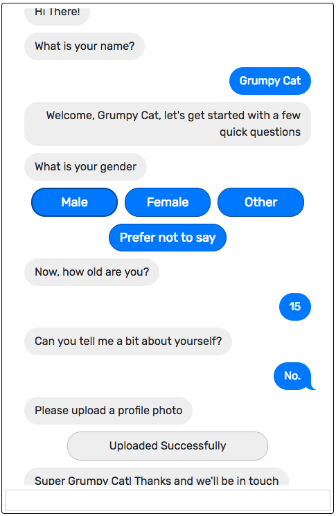

# Hatool

A themeable chat-like UI element for Angular 7+.

### See [demo](https://akariv.github.io/hatool/)

---

This project was generated with [Angular CLI](https://github.com/angular/angular-cli) version 7.1.3.

## Building the library

Run `npm package` to build the library. The build artifacts will be stored in the `dist/hatool` directory.

For development, you can use `ng build hatool --watch` for rebuilding the package whenever a source file changes.

## Development server

Run `npm start` for a dev server. Navigate to `http://localhost:4200/`. The app will automatically reload if you change any of the source files.

## Code scaffolding

Run `ng generate component component-name` to generate a new component. You can also use `ng generate directive|pipe|service|class|guard|interface|enum|module`.
